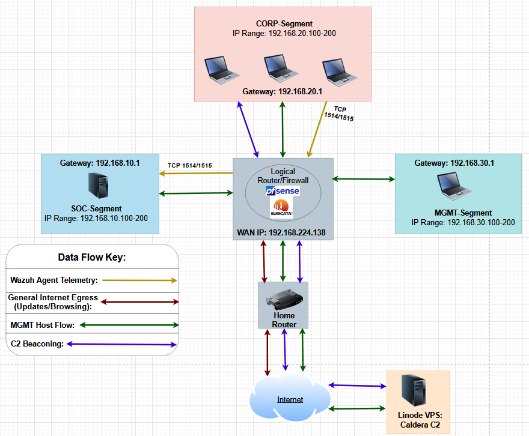
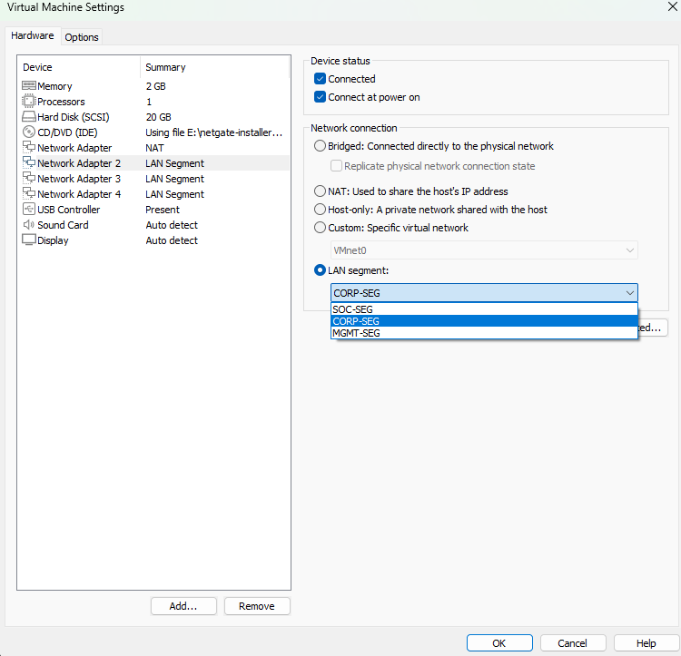
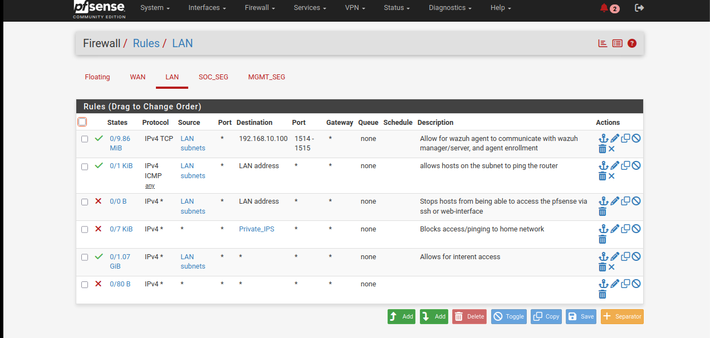
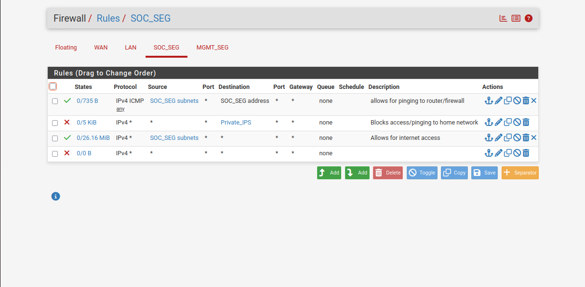
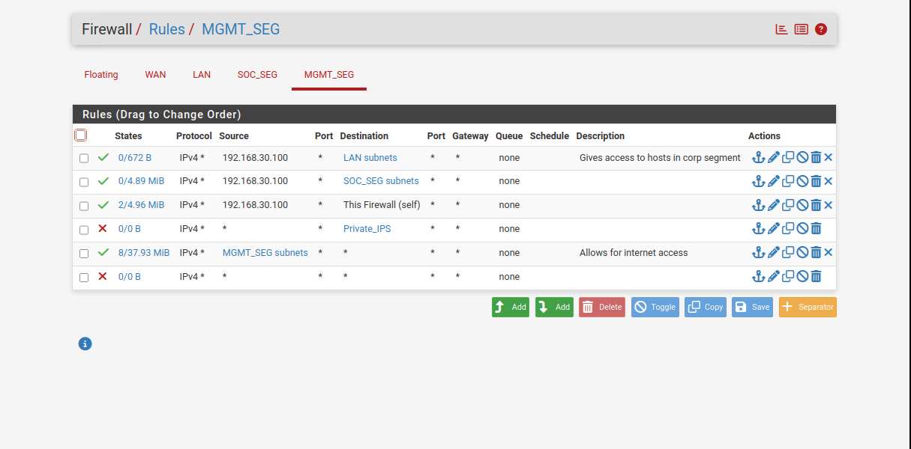
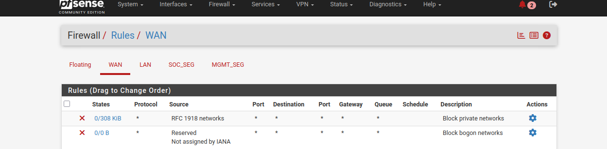
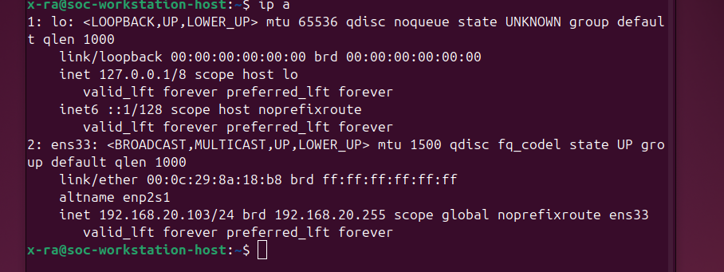
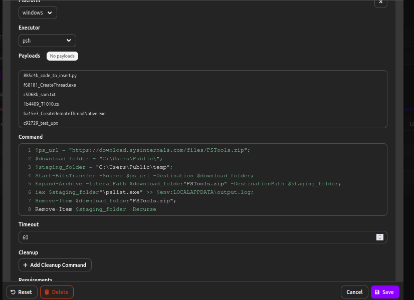
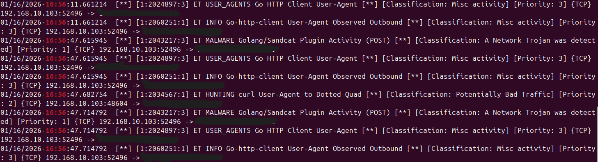

# Enterprise Security & Adversary Emulation Lab (Purple Team Lab)

A custom-built Purple Team home lab that simulates a segmented enterprise network, centralizes endpoint telemetry, and validates detections using automated adversary emulation with a hybrid-cloud C2.

> **Goal:** Build a resilient, observable environment (Defense-in-Depth) and prove detection/visibility using real tactics aligned to **MITRE ATT&CK**.

---

## Table of Contents
- [🧭 Lab Goals](#lab-goals)
- [Architecture Overview](#architecture-overview)
- [🌐 Network Segmentation](#network-segmentation-micro-segmentation)
- [pfSense Firewall Rules](#pfsense-firewall-rules-segmentation-enforcement)
- [Security Stack](#security-stack)
- [Purple Team Validations](#purple-team-validations)
  - [Windows: Process Discovery (T1057)](#windows-process-discovery-t1057)
  - [Linux: Data Staging + Exfiltration (Multi-Technique)](#linux-data-staging--exfiltration-multi-technique)
- [Key Outcomes](#key-outcomes)
- [Future Optimization](#future-optimization)
- [Lessons Learned (Conclusion)](#lessons-learned)

---
---

## 🧭 Lab Goals
This lab was designed to demonstrate practical security engineering and detection validation:
- **Micro-segmentation** to reduce lateral movement
- **Centralized logging + endpoint visibility** via SIEM/EDR-style telemetry
- **Network inspection at the choke point** (gateway-level IDS)
- **Adversary emulation** using a cloud-hosted C2 to simulate realistic attacker workflows
- Evidence-driven reporting aligned to **MITRE ATT&CK**

---

## 🛣️ Architecture/Data Flow Overview

### High-Level Data Flow
- Endpoints generate host telemetry → **Wazuh** (SIEM/EDR-style manager)
- Network traffic traverses pfSense → **Suricata** inspects traffic at the gateway
- Adversary emulation executes from a cloud VPS → **Caldera** controls agents in the lab

### Data Flow Explanation (Diagram Key)

- **Yellow (Wazuh Agent Telemetry):** Unidirectional telemetry flow from Wazuh agents on CORP endpoints to the Wazuh manager in the SOC segment over **TCP 1514/1515**. All agent traffic routes through **pfSense** before reaching the SOC server.
- **Red (General Internet Egress):** Standard outbound internet traffic (e.g., updates/browsing) from hosts across the internal subnets. This traffic exits through **pfSense** and then routes to the home router/internet.
- **Green (MGMT Host Flow):** Administrative traffic originating from the **MGMT segment**. This host has controlled cross-segment access (e.g., **SSH/HTTP(S)**) to systems in CORP and SOC, and can also reach external resources such as the **Linode VPS** for Caldera administration.
- **Purple (C2 Beaconing):** External Command-and-Control beaconing path from CORP hosts to the **Caldera C2** hosted on the Linode VPS. Beacon traffic routes **CORP → pfSense → home router → internet → Linode VPS**, demonstrating realistic outbound C2 communications under segmented network controls.

---
---

## 🌐 Network Segmentation (Micro-Segmentation)

  <h2><b>Network Topology</b></h2>

The lab is segmented into distinct security zones using pfSense as the central router/firewall. Each subnet represents a separate trust boundary to reduce lateral movement and enforce least-privilege network access.

## Segments and IP Address Configuration (As Implemented) ##

### PfSense VM Network Interface Configuration ###

### Segment Breakdown and IP Addressing ###
| Segment | CIDR / Subnet | Gateway | Role | Key Assets |
|--------|----------------|---------|------|------------|
| **WAN** | `192.168.224.0/24` | `192.168.224.138` | External interface that provides internet connectivity to internal hosts and allows for outbound/inbound C2 traffic | pfSense WAN (Firewall/Router) |
| **CORP-SEG** | `192.168.20.0/24` | `192.168.20.1` | Corporate workstations; simulates normal browsing and day-to-day work activities (attack targets) | Ubuntu Desktop `192.168.20.103`, Windows 10 `192.168.20.108` |
| **SOC-SEG** | `192.168.10.0/24` | `192.168.10.1` | Security operations zone that hosts Docker/Portainer and Wazuh; a central location for telemetry ingestion and monitoring tools | Security Server `192.168.10.100` (Wazuh, Docker/Portainer) |
| **MGMT-SEG** | `192.168.30.0/24` | `192.168.30.1` | Administrative/management zone that controls cross-segment access; supports monitoring via the Wazuh dashboard, SSH capabilities, web-interface interactions, and handles Caldera operations/configurations | Management Host `192.168.30.100` |

### Segmentation Objectives
- **Contain compromise:** A compromised CORP endpoint should not directly reach SOC systems.
- **Protect security tooling:** SOC-SEG remains isolated and only accepts explicitly required traffic (e.g., Wazuh agents).
- **Centralize control:** All cross-segment and internet-bound traffic routes through **pfSense**, where firewall policy and inspection are enforced.
- **Realistic enterprise model:** Separating CORP, SOC, and MGMT mirrors common real-world architectures.

---
---

## 🧰 pfSense Firewall Rules (Segmentation Enforcement)

pfSense serves as the lab’s central **router + firewall**, enforcing **least privilege** between security zones. Rules are intentionally simple and auditable: explicitly allow only what is required (telemetry, basic connectivity, internet access for updates/C2), block sensitive internal access paths, and rely on a final deny rule to prevent accidental exposure.

### Design Goals
- Allow endpoint telemetry to the **SOC tools server (Wazuh)** while keeping SOC isolated
- Prevent **CORP → SOC** access (reduce lateral movement paths)
- Prevent endpoints from accessing the **pfSense management interface**
- Block access to **Private/Home networks** (safety boundary)
- Permit controlled **internet access** for updates + adversary emulation workflows
- Enforce a **default-deny** baseline

### CORP-SEG (LAN) Rules
| Action | Proto | Source | Destination | Dest Port | Purpose |
|-------|-------|--------|-------------|----------|---------|
| ✅ Pass | TCP | LAN subnets | `192.168.10.100` (Wazuh) | `1514–1515` | Allow Wazuh agent communication + enrollment |
| ✅ Pass | ICMP | LAN subnets | LAN address (pfSense) | — | Allow hosts to ping router for connectivity checks |
| ❌ Block | Any | LAN subnets | LAN address (pfSense) | — | Prevent CORP hosts from accessing pfSense (SSH/Web UI) |
| ❌ Block | Any | Any | `Private_IPS` (alias) | — | Block access/pinging to home/private network ranges |
| ✅ Pass | Any | LAN subnets | Any | — | Allow internet access (updates + controlled egress) |
| ❌ Block | Any | Any | Any | — | Default deny (catch-all) |

📌 Evidence:  

### SOC-SEG Rules
| Action | Proto | Source | Destination | Dest Port | Purpose |
|-------|-------|--------|-------------|----------|---------|
| ✅ Pass | ICMP | `SOC_SEG subnets` | SOC_SEG address (pfSense) | — | Allow SOC hosts to ping router/firewall |
| ❌ Block | Any | Any | `Private_IPS` (alias) | — | Block access/pinging to home/private network ranges |
| ✅ Pass | Any | `SOC_SEG subnets` | Any | — | Allow internet access (updates/signature pulls) |
| ❌ Block | Any | Any | Any | — | Default deny (catch-all) |

📌 Evidence:  

### MGMT-SEG Rules
| Action | Proto | Source | Destination | Dest Port | Purpose |
|-------|-------|--------|-------------|----------|---------|
| ✅ Pass | Any | `192.168.30.100` | LAN subnets (CORP) | — | MGMT host can administer/monitor CORP endpoints |
| ✅ Pass | Any | `192.168.30.100` | `SOC_SEG subnets` | — | MGMT host can access SOC segment for tooling/triage |
| ✅ Pass | Any | `192.168.30.100` | This Firewall (self) | — | MGMT host can reach pfSense for administration |
| ❌ Block | Any | Any | `Private_IPS` (alias) | — | Block access/pinging to home/private network ranges |
| ✅ Pass | Any | `MGMT_SEG subnets` | Any | — | Allow internet access (admin tooling + VPS access) |
| ❌ Block | Any | Any | Any | — | Default deny (catch-all) |

📌 Evidence:  

### WAN Rules

#### Why This Matters 
These rules demonstrate practical enterprise fundamentals: **segmentation**, **least privilege**, and **secure management boundaries**. Even if an endpoint is compromised in CORP, the attacker cannot directly pivot into the SOC network or pfSense management interface, while still allowing the minimum traffic needed for monitoring, updates, and controlled adversary emulation.

---
---

## 🛡️ Security Stack

### Endpoint Telemetry and Detection (Wazuh)
- Wazuh agents deployed to endpoints for continuous telemetry
- **File Integrity Monitoring (FIM)** enabled on Linux + Windows
- Enhanced Windows auditing for scripting visibility
  - PowerShell logging (including script block events like **Event ID 4104**)

**Proof of Agent Integration**

### Network IDS at the Choke Point (Suricata on pfSense)
- Suricata runs directly on pfSense to inspect north-south and inter-segment traffic
- **ET Open / Emerging Threats** ruleset enabled for current network signatures

### Adversary Emulation (Caldera on VPS)
- **Cloud-hosted Caldera** on a Linode VPS (hybrid-cloud C2)
- Caldera agents installed on CORP endpoints and configured to beacon over HTTP/HTTPS

---
---

## 🎯 Purple Team Validations

### Windows: Process Discovery (T1057)
- **Objective:** Validate detection and visibility for local reconnaissance on a Windows endpoint.
- **Adversary Technique:** **T1057** – Process Discovery
- **Emulation:** Caldera executed an automated profile on the Windows host to enumerate running processes and query system information.

  

#### Detection Evidence
- **Endpoint Level:** The Wazuh agent successfully captured the execution of obfuscated and clear-text PowerShell scripts.
- **Telemetry Verification:** As seen in the screenshots, Wazuh alerted on Event ID 4104, providing full visibility into the script content, including directory expansion and system variable queries.
- **FIM/integrity alerts** Wazuh triggered alerts for Registry Integrity Checksum changes, identifying the attacker's attempt to modify system persistence or configurations during the enumeration phase.

✅ **Result:** Host-level telemetry provided actionable visibility into discovery activity.

**Predicted Catched Output on Wazuh Dashboard**

📌 Catched Results From the Wazuh Dashbord:  

---

### Linux: Data Staging + Exfiltration (Multi-Technique)

**Objective:** Validate network and endpoint visibility against staged collection and exfiltration behavior.

**MITRE ATT&CK Techniques**
- **T1005** – Data from Local System  
- **T1074.001** – Local Data Staging  
- **T1560.001** – Archive via Utility  
- **T1041** – Exfiltration Over C2 Channel

**Emulation Workflow**
1. Collected local data  
2. Staged it in a hidden directory  
3. Archived it as `staged.tar.gz`  
4. Exfiltrated over the C2 channel to the Caldera VPS  

#### Detection Evidence
- **Suricata** flagged suspicious C2 communication  
  - Example: `ET MALWARE Golang/Sandcat Plugin Activity (POST)`
  - Outbound connection to VPS IP `172.238.183.44`
- **Wazuh FIM** alerted on archive creation  
  - `/home/x-ra/staged.tar.gz` added  
- Manual verification confirmed staged artifacts on disk

✅ **Result:** Network + endpoint telemetry correlated to confirm the attack chain.

📌 Screenshots:  

 
---
---

## Key Outcomes
- **Segmentation enforced (Defense-in-Depth):** pfSense micro-segmentation created clear trust boundaries between CORP, SOC, and MGMT to reduce lateral movement risk.
- **Actionable endpoint visibility:** Wazuh provided host-level telemetry (Windows auditing + FIM) to detect discovery and file/registry changes tied to attacker behavior.
- **Network-level detection at the choke point:** Suricata on pfSense detected suspicious outbound C2-style traffic using Emerging Threats signatures.
- **Validated purple team workflow:** Adversary emulation (Caldera) produced repeatable attack chains mapped to **MITRE ATT&CK**, with detections confirmed through log evidence and screenshots.

---

## 🔭 Future Optimization and Enhancements

At its current state, the lab is functioning as designed: Wazuh agents are successfully generating endpoint telemetry, pfSense firewall rules are enforcing segmentation and least-privilege access, and both inbound and outbound traffic paths are behaving as expected. Adversary emulation traffic, management access, and general internet egress are all clearly observable and controllable through the firewall.

That said, several areas have been identified for improvement to further mature the environment and bring it closer to a real-world enterprise deployment.

One key enhancement is deeper integration between **Suricata** and **Wazuh**. While Suricata is correctly inspecting traffic at the pfSense gateway and logging events locally, those logs are not yet fully ingested into the Wazuh dashboard. Integrating Suricata JSON output into Wazuh via custom decoders and rules would create a more centralized monitoring experience, allowing network-based alerts to be correlated directly with host-level telemetry during investigations. This would significantly improve detection triage and incident correlation across layers.

Another planned improvement is the introduction of a **Kali Linux attack host**. This system would intentionally operate **without a Wazuh agent**, serving as an unmanaged adversary platform for manual exploitation, reconnaissance, and post-exploitation testing. This addition would allow comparison between detections generated by automated adversary emulation (Caldera) and those produced by hands-on offensive techniques, further strengthening the purple team workflow.

Finally, a major future enhancement is the implementation of an **Active Directory (AD) environment**. Introducing domain-joined systems, centralized authentication, and group policy enforcement would transform the lab into a more realistic enterprise network. This would enable testing of common attack paths such as credential harvesting, Kerberos abuse, lateral movement, and privilege escalation, while also validating defensive controls, logging, and detection strategies in a domain-based environment.

Together, these improvements will evolve the lab from a segmented detection-focused environment into a full enterprise security simulation capable of supporting advanced red, blue, and purple team scenarios.

---
---

## 📚 Lessons Learned (Conslustion) 📚

> ✅ **Project takeaway:** This lab reinforced that strong security engineering is less about “installing tools” and more about **designing a realistic environment, enforcing least privilege, and validating detections with evidence**. The final result is a segmented enterprise-style network with centralized telemetry and repeatable adversary emulation—built within real hardware constraints.

Going into this project, I already had familiarity with virtual machines, security tooling like **pfSense** and **Wazuh**, and working in the command line. However, reaching the final outcome required multiple design iterations, troubleshooting cycles, and infrastructure adjustments that ultimately strengthened the lab and made it more realistic.

One of the biggest factors shaping the design was **infrastructure and hardware limitations**. My goal was to build a budget-friendly lab using the PC I already had available: **32 GB RAM, a 6-core/12-thread CPU, and 1.5 TB of storage**. With those constraints, my first attempt was deploying **Security Onion (Community Edition)** because it is an extremely powerful “all-in-one” security platform that can include tools such as **Suricata, Zeek, Elastic Stack, Stenographer, Osquery**, and utilities like **CyberChef** and **Strelka**. However, this approach was not successful on my available hardware due to resource overhead. That failure led to a key lesson: selecting tools is not only about features—it is also about **operational feasibility** and performance in the environment you actually have.

To keep visibility high while staying within system constraints, I pivoted to **Wazuh** as the SIEM/EDR-style solution. Wazuh still provides strong coverage through its integration with the Elastic Stack (**Elasticsearch, Logstash, Kibana**) and supports **endpoint agents** for consistent host telemetry. This approach gave me reliable logging, file integrity monitoring, and Windows event visibility without the heavier footprint of a full Security Onion deployment. In addition, implementing a network IDS like **Suricata** on pfSense gave me strong visibility into north/south and inter-segment traffic at the network choke point, without introducing significant operational overhead or requiring additional sensors on each host.

Another major design decision was building the lab as a more realistic enterprise-style network by implementing **segmentation**. Using **VMware Workstation**, I created separate network segments and used **pfSense** as the logical router/firewall. This gave me Layer 3 traffic control (routing + firewall policy enforcement) and allowed me to build clear trust boundaries between CORP, SOC, and MGMT. One limitation I encountered is that VMware Workstation does not provide the same depth of Layer 2 control that is possible in more advanced virtualization platforms (e.g., vSphere), where you can apply more granular switching controls and enforce stronger intra-segment restrictions (such as controlling host discovery behavior within the same VLAN/subnet). Even with that limitation, segmentation with pfSense provided meaningful security value by reducing lateral movement paths and forcing cross-segment traffic through a central control point.

The core segmentation setup was straightforward from an implementation standpoint: define the segments in VMware, add **four NICs** to the pfSense VM (NAT, CORP, SOC, MGMT), and manually assign/accept each interface inside pfSense. Spinning up endpoints from the correct ISO files and assigning static IPs for initial testing was also direct and provided early confirmation that routing and basic connectivity were working properly.

A major learning milestone was containerization. Setting up **Wazuh and Portainer inside Docker containers** was new for me and required time spent reading documentation, validating configurations, and troubleshooting deployment issues. This step was not necessarily “hard,” but it was time-consuming and taught me that implementation speed often comes down to how well you understand the supporting infrastructure (Docker networking, volumes, container health, and service dependencies).

The **most challenging part of the entire project** was integrating firewall and NIDS telemetry—specifically ensuring that **pfSense logs and Suricata alerts** could be reliably forwarded into the **Wazuh manager** in the SOC segment. Initially, I attempted what felt like the simplest approach: installing a Wazuh agent directly onto pfSense. After hours of research and trial-and-error, I learned that this approach was not feasible due to a compatibility limitation between pfSense’s underlying **FreeBSD version** and the available Wazuh agent builds. This was an important lesson in real-world security engineering: sometimes the “obvious” solution is blocked by platform constraints, and the correct approach becomes finding a secure workaround rather than forcing an unsupported install.

To solve this, I implemented an **agentless log forwarding design** using **syslog-ng**. The purpose of syslog-ng in this setup was to reliably collect logs from pfSense and related services (including Suricata) and forward them to Wazuh in a format that could be consistently parsed and ingested. This mattered because pfSense syslog behavior does not always align cleanly with strict hostname/header expectations, and Wazuh relies heavily on predictable log structure for decoders and rules. The implementation required several manual configuration steps: configuring pfSense system logs to loop back to a port monitored by syslog-ng, defining syslog-ng inputs/outputs, forwarding the traffic to the Wazuh server over **port 514**, and then configuring the Wazuh manager (`ossec.conf`) to accept that log stream. To improve parsing, I also created custom logic in **local decoders** and **local_rules.xml**, especially for Suricata data being forwarded through the syslog pipeline.

This part of the project is still an active improvement area: while pfSense and Suricata logs are currently reaching Wazuh, ingestion is **not yet fully consistent**, and some Suricata alerts lack the richer metadata that is visible directly within pfSense. Based on my current results, this is strongly tied to decoder/rule tuning and how the forwarded event format is being interpreted. The positive outcome is that endpoint telemetry from Wazuh agents is working reliably, while network telemetry and pfSense integration has a more managable/clear roadmap for refinement.

Building firewall policy was another key learning area. I had not previously created segmentation rules at this level, so this required trial-and-error, iterative testing, and adjustment. Over time, I improved the ruleset into a clean, auditable model: allow only required traffic (telemetry, updates, controlled management) and block sensitive internal access paths by default. This reinforced the practical meaning of **least privilege** and showed how segmentation becomes meaningful only when firewall rules are intentionally designed and validated.

Finally, deploying adversary emulation with **Caldera** was relatively straightforward compared to log forwarding, but it still introduced real-world troubleshooting. Installing agents on Linux hosts was smooth, while Windows required additional handling due to Windows Defender interference (which needed to be disabled in this lab context for the agent to function properly). I also had to adjust endpoint configurations to strengthen visibility, including enabling **File Integrity Monitoring** and ensuring **PowerShell script block logging** was captured by the wazuh agent and forwarded to the Wazuh server(soc server).

Overall, this project was a major learning experience in building secure architecture under constraints. It taught me how to design and enforce segmentation, build telemetry pipelines, implement least privilege controls, and validate detection capability using repeatable adversary emulation. While additional tuning is still needed—especially around Suricata-to-Wazuh parsing and correlation—the lab represents a strong baseline that can be expanded and scaled into an even more realistic enterprise security simulation over time.

